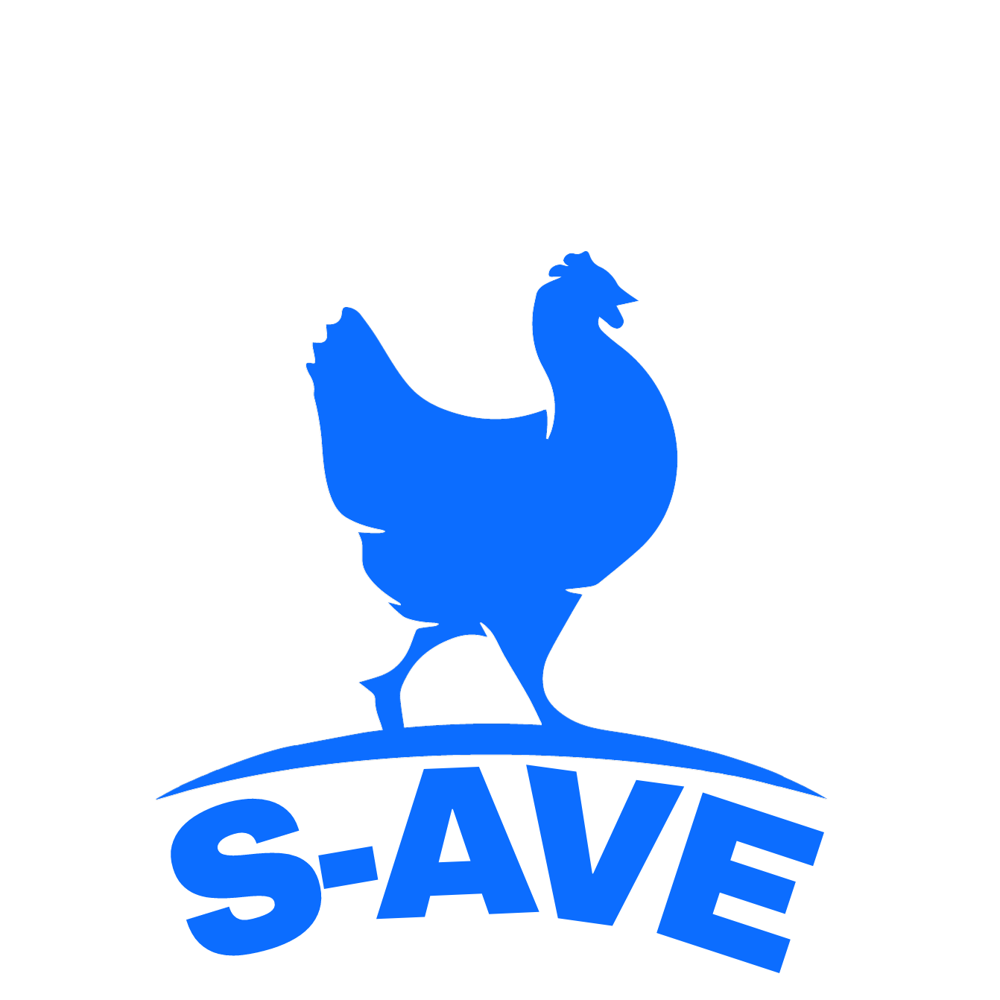

<p align="center">
  
</p>

<p align="center">
  
       
  

</p>

---

Projeto desenvolvido para trabalho de AEP do 4º semestre de Egenharia de Software.

## 💻 Objetivo

 - Organizar os dados dos lotes de aves cadastrados no sistema. 
 - Expandir o suporte dado pela tecnologia da informação na vida do trabalhador rural. 

## 🚀 Tecnologicas

Esse projeto foi desenvolvido com as seguintes tecnologias:

 - JAVA
 - MYSQL

## 📘 Recursos necessários

- NetBeans
- XAMPP

## 🗺 Instalação da aplicação

 1. Utilize um terminal da sua escolha e rode o seguinte comando

```bash
 git clone https://github.com/Czpla/s_aves.git
```

2. Abra o editor NetBeans


